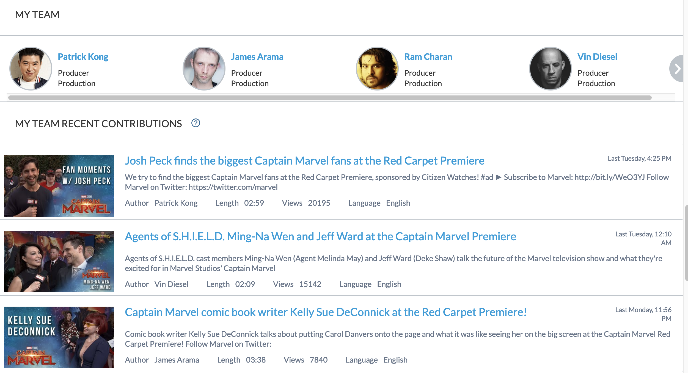
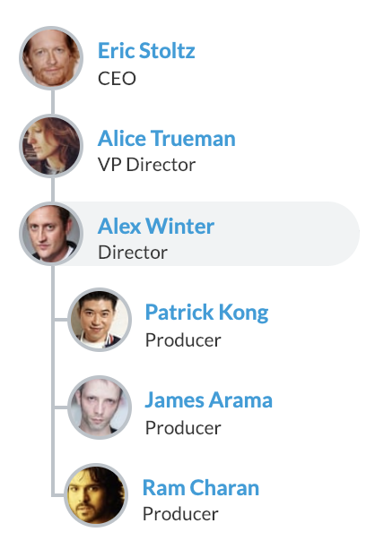

Coveo is rapidly growing, and moving fast; it can be a challenge to keep track of newcomers or to know what our colleagues are now working on.

To help us overcome this challenge, we created an internal _People page_ using Coveo, where we showed recent contributions someone made alongside their profile, making it quite a useful tool for new employees to learn about their new co-workers.


<!-- more -->

To access someone's page, we have a handy internal search page, which behaves like your typical people search page. But, when clicking on someone's name, we access their profile.

This profile shows a list of the employee's recent contributions, team members, position in the organization chart, active projects, and the recent contributions from their team. The point of this page is to show their area of expertise within the company.

This profile - or People page - is still a Coveo Search page with the same great features like relevance or security. You won't see _secret projects_ from other members here if you don't have access to these projects yourself.

## The Data

Our People page is fed from our own index. Naturally, the first step is to get the data into our index.

To do so, we are crawling our Active Directory with our own [crawler](https://github.com/coveo-labs/active-directory-crawler), before sending the data to a [Push API](https://docs.coveo.com/en/78) source we called _Employees_.

For each person, we get their basic information (name, email, etc.) and their reporting structure (their manager and their direct reports).

We also have multiple other sources in our index: Salesforce, Jira, Discourse, Google Drive, Internal Documentation, Public Documentation, etc. Most sources have their own fields describing who created what and who modified it.

To reduce complexity at query time, we normalize the fields using common field names for all sources to identify who worked on a document. We called those fields `@authors` for document creators ,and `@contributors` for people who modified the document; the latter is set as a multi-value fields on the Coveo platform.

For example:

Our _Jira_ source maps `author.emailaddress` to `@authors`, and `fields.assignee.emailaddress` and `fields.comment.comments.author.emailaddress` to `@contributors`.


Our _Google Drive_ source maps `author` to `@authors`, and `lastmodifyingyser.emailaddress`, `coveo.owner.email`, and `coveo.comments.authors` to `@contributors`.


To create the Employee page below (taken from [our intranet demo](https://labs.coveodemo.com/demo-intranet)), we are using a few more tricks:
- [GroupBy/Facets](https://docs.coveo.com/en/1384/cloud-v2-developers/implementing-facets) for the bar charts, with query events
- Browser cache for basic employee information
- [Search interface](https://docs.coveo.com/en/1370/cloud-v2-developers/implementing-a-search-interface) and [result templates](https://docs.coveo.com/en/413/javascript-search-framework/javascript-search-framework-result-templates)


## Getting People's Contributions

Using the fields we mapped in the Indexing phase, we are getting the contributions of a person using the following query. Note that some systems only identify people using their full names and not their email address, so we need to expand them in the query.
```text
q: @authors==("Alex_Winter@elasticdemo.com", "Alex Winter") OR @contributors==("Alex_Winter@elasticdemo.com", "Alex Winter")
aq: @date>="today-30d"
groupBy: [
  {"field":"@source","injectionDepth":1000},
  {"field":"@jiprojectname","injectionDepth":1000},
  {"field":"@discusscoveocategoryname","injectionDepth":1000},
  {"field":"@confspacename","injectionDepth":1000},
  {"field":"@objecttype","injectionDepth":1000}
]
```

We then do the same query for that person's team, expanding all team members:
```text
q: @authors==("Patrick_Kong@elasticdemo.com", "Patrick Kong", "James_Arama@coveo.com", "James Arama", "Walter_Sittler@coveo.com", "Walter Sittler") OR @contributors==("Patrick_Kong@elasticdemo.com", "Patrick Kong", "James_Arama@coveo.com", "James Arama", "Walter_Sittler@coveo.com", "Walter Sittler")
```

## Facets as bar charts


In search responses, the facets information is stored in the JSON as a `groupBy`. It's an array of `field` and their associated `values` to show in the facets, along with the count for each value as `numberOfResults`. It looks something like this:

```json
[{
  "field": "@source",
  "values": [
    { "value": "PeopleMovie", "numberOfResults": 28 },
    { "value": "Movies", "numberOfResults": 28 },
    { "value": "Youtube Speedbit", "numberOfResults": 1 },
    { "value": "Sharepoint", "numberOfResults": 1 },
    { "value": "People", "numberOfResults": 1 },
    { "value": "Doc FitBit", "numberOfResults": 1 }
  ]
}, {
  "field": "@myjob",
  "values": [
    { "value": "Acting", "numberOfResults": 13 },
    { "value": "Director", "numberOfResults": 10 },
    { "value": "Writer", "numberOfResults": 3 },
    { "value": "Producer", "numberOfResults": 2 }
  ]
}, {
  "field": "@myrole",
  "values": [
    { "value": "Director", "numberOfResults": 11 },
    { "value": "Writer", "numberOfResults": 3 },
    { "value": "Himself", "numberOfResults": 3 },
    { "value": "Producer", "numberOfResults": 2 },
    { "value": "Bill S. Preston", "numberOfResults": 2 },
    { "value": "Schatzi Greenspace", "numberOfResults": 1 },
    { "value": "Marko", "numberOfResults": 1 }
  ]
}]
```

Each value becomes one bar in the chart, and is represented using this HTML code:
```html
<div class="userpage-stats-item">
  <div class="userpage-stats-label" title="Acting">Acting</div>
  <svg width="200" height="20" viewBox="0 0 200 20" xmlns="http://www.w3.org/2000/svg">
    <line x1="0" y1="10" x2="160" data-value="13" data-max="13" y2="10" stroke-width="10" stroke="#F58020"></line>
    <text x="170" y="15" fill="#F58020">13</text>
  </svg>
</div>
```

We use a Query Event (`querySuccess`) to process the results into the bar charts:

```javascript
// Handler for the search response; it will call generateStatsSection for each category
// The generated HTML will update a DOM node (id="userpage-stats") already present on the page
let onSuccess = function(e, args) {
  let groupByResults = args.results.groupByResults;
  if (groupByResults.length) {
    let barChartsHtml = [
      generateStatsForSection('Sources', groupByResults[0].values),
      generateStatsForSection('Jobs', groupByResults[1].values),
      generateStatsForSection('Characters', groupByResults[2].values)
    ];

    $('#userpage-stats')
      .empty()
      .html( barChartsHtml.join('') );
  }
};

let generateStatsForSection = function(name, results) {
  // Calculate the maximum value for this section, to get relative sizes for the bars
  const max = Math.max(...(results.map(v => v.numberOfResults)));

  // Creates an array of bars (in HTML code)
  let aHtml = results.map( (v, idx) => {
      const color = COLORS[idx % COLORS.length]; // We use a prefined array of colors, and we cycle through them
      const xPos = Math.min(160, (160 * v.numberOfResults) / max); // Maximum value will be set at 160px

      // HTML + SVG code for a bar, using JavaScript's template literals
      return `<div class="userpage-stats-item">
          <div class="userpage-stats-label" title="${e(v.value)}">${e(v.value)}</div>
          <svg width="200" height="20" viewBox="0 0 200 20" xmlns="http://www.w3.org/2000/svg">
            <line x1="0" y1="10" x2="${xPos}" data-value="${v.numberOfResults}" data-max="${max}" y2="10" stroke-width="10" stroke="${color}"></line>
            <text x="${xPos + 10}" y="15" fill="${color}">${v.numberOfResults}</text>
          </svg>
        </div>`;
    });

  // Return the generated HTML for all bars in this section
  return aHtml.join('\n');
};

// Set up the Query Event
Coveo.$$(root).on('querySuccess', onSuccess);

```

> Tip: you can use inline _SVG_ to generate other types of visualizations, or third party libraries like D3 with the result numbers from groupBy.

## Optimizations using the browser cache

The *Team* section and the organization chart are built dynamically client side, in the browser. To keep it simple, we are fetching one user at a time, then their manager if they have one, then the manager's manager, and so on.

While being quite simple to use, it would be inefficient to redo the same queries for the same members when _browsing the org chart_. We use the browser's session storage to make it more efficient. We will fetch one member information only once per _web session_, which is perfect for this case. This way we get the efficiency of doing only one request per member, and we don't have to manage the cache ourselves; the browsers do it and the member's cache stays fresh.






We use a JavaScript promise to get the User (member) info. We first check if the member is in the cache. If not, we query it, store it, and then resolve the promise.

Here's the code to get the user info:

```javascript
/**
 * This function checks the browser's (session) storage for the user info, using their email as the key.
 * If necessary, the function will query Coveo for the info and cache it before returning.
 * @param userEmail {string} email of the user to get
 * @returns {Promise}
 */
getUserInfo(userEmail) {
  const key = `@email=="${userEmail}"`;

  // Check storage using email query as key
  let user = sessionStorage.getItem(key);
  if (user) {
    // Find the user info in storage, parse it, and return it
    return Promise.resolve(JSON.parse(user));
  }

  const myQueryBuilder = new Coveo.QueryBuilder();
  myQueryBuilder.expression.add(key); // Query using the user email
  myQueryBuilder.expression.addFieldExpression('@filetype', '==', ['activedirperson']); // Limit results to Active Directory

  const coveoSearchEnpoint = Coveo.SearchEndpoint.endpoints['default'];
  const searchPromise = coveoSearchEnpoint.search(myQueryBuilder.build());
  searchPromise.then(queryResults => {
    // Validate result before saving it in the browser's session storage
    let results = queryResults.results;
    let user = null;
    if (results && results.length) {
      user = results[0].raw;
      if (userEmail === user.email) {
        sessionStorage.setItem(key, JSON.stringify(user)); // User is valid. Save it in session storage
      } else {
        console.error(`WRONG user; userEmail "${userEmail}" (used as key) doesn't match the returned user.email "${user.email}". `);
      }
    }
    return user;
  });

  return searchPromise;
}
```

Now, we put it all together in a Class to create an organization chart:

```javascript

class OrgChart {

  getUserInfo(user) {
    // See the code above
  }

  getUsersInfo(users) {
    if (users) {
      return Promise.all(
        users.map(workemail => {
          return this.getUserInfo(`@workemail=="${workemail}"`);
        })
      );
    }
    return Promise.resolve([]);
  }

  showOrg(userEmail) {
    this.getUserInfo(userEmail).then(userJson=>{
      // Get all managers
      this.getUserInfo(userJson.managers).then(managersJson => {
        // Get all direct reports
        this.getUserInfo(userJson.directreports).then(directReportsJson  => {
          // Show the user on the page
          this.renderOrg(userJson, managersJson, directReportsJson);
        })
      })
    })
  }

  renderOrg(user, managers, directReports) {
    // Create your own layout for your Company
  }

}
```

## Conclusion

Coveo search interfaces don't always need to have your typical search page experience; they can be used as an aggregator of relevant content for one _topic_ - in this case, an employee.

We used a few tricks from the Coveo platform like [query events](https://coveo.github.io/search-ui/classes/queryevents.html) and [facets](https://docs.coveo.com/en/1571/cloud-v2-administrators/understanding-facets) to create different visualizations. We also have the peace of mind from Coveo's support of secured content that sensitive information won't be surfaced to the wrong users.

Using the same approach, many applications such as a landing/welcome page for an Intranet or Products pages can be created using the Coveo platform, or the [No Results](https://source.coveo.com/2019/01/22/popular-results-when-no-results/) or [404 - Not Found](https://blog.coveo.com/404-no-more-rethinking-page-not-found/) pages.
