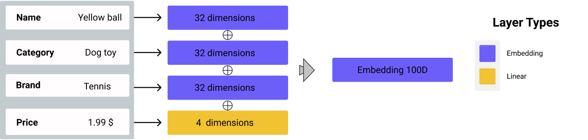
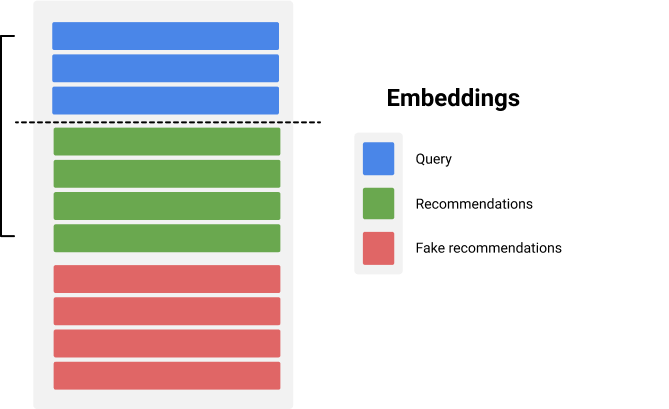

<!-- Imagine that you bought a wonderful shirt and you are missing the perfect pair of pants to fit with it. You walk into a store, browse everything and realize you are clueless on what could be a good match. There are so many different tints, shapes and varieties! Then, the salesperson feels your despair and comes to you. You take a few second to show a picture of the shirt and without any question, the sale -->

[TOP_INTRODUCTIVE_IMAGE]

In its most intuitive form, a good recommendation leads you to find the product that fits your needs. This product in itself can take any form. It can be a music, a movie, a restaurant, an article or even a gardening tool. The only thing that matters is that the recommendations are personnalized to you, based on your interactions with the platform and in real time. Instead of relying on matrix factorization methods and statistics that only have a macroscopic view of the interactions between users and items, we created a model which relies on deep learning and embedding spaces which harnesses a more intricate understanding of the items and allows for more explanable and controlable recommendations. Explanable because we can return a lot of information on your intents that are leading you to a specific recommendation and controlable because its parameters can be changed at query time allowing you to adjust your recommendation needs.

## Session Aware Recommendations

[SALESPERSON_IMAGE_HAPPY_BEHAVIOUR]

We propose the *Session aware recommender*, a model follows you along your shopping or browsing session. A session is defined by a bloc of uninterrupted browsing (with less than 20 minutes of inaction). By considering your history and your current actions, it generates recommendations that are up to the point with what you want __right now__. Items that represents your current interest are vectorized in a complex form that integrates factors such as their name, category, brand and price. Then, they are compared with all the other items in the catalog for their similarity. The items that are the most likely to fit your intent are returned as recommendations. All the vectors are pretrained periodically with our idea of a [Word2Vec](https://en.wikipedia.org/wiki/Word2vec) adapted to purchase recommendation. By integrating more parameters into the embeddings than solely the user-item interactions, we allow more personalized and diverse recommendations. More than that, paired with our training method, there is a way to control the trade-off between similarity and diversity and a way to gage the precedence of your past into the algorithm.

## How does it acquire its awareness?

The *Session aware recommender* is focussed on your near past and current intention. First, in order for this model to work, there is a backend task that needs to be run to train the vectors, also called embeddings, that are created and stored periodically. Then, it its production phase, the model is ready to serve recommendations to the users as they go on their journey. Its awareness is defined by its capability to adapt quickly to a change of intent. What we mean by that is; let's say that you are shopping for cat food and suddenly, you think about that wonderful toy you wanted to buy but which was unavailable. Change of intent. You went from one specific kind of item to another and both intentions are correct, but both are also distinct. The issue nowadays, is that similarity models are computing an average of all the items you have seen. So, it would average these two different items as one intent, without considering them any different! Hence, it would generate biased recommendations. As if the recommended product would be represented by an equal mix of these two completely incompatible things. Is there really an average between food and toys? Or should it be two different sets of recommendations? The *session aware recommender* tests all the different combinations and decides which is most likely to interest you and this is where it shines.

In a few steps, it does the following:
1. From your history and ongoing actions, it defines what is your current and few previous intents;
2. It converts the item contained within these intents into embeddings;
3. It computes the average combinations of all the embeddings then uses cosine similarity is used to compute the most similar items;
4. It returns the number of wanted highest ranking similarities as recommendations.

## How we create our embeddings

The embeddings we create are composed of four vectors all randomly initialized.
1. An embedding layer for the item name - 32 dimensions;
2. An embedding layer for the category - 32 dimensions;
3. An embedding layer for the brand - 32 dimensions;
4. A linear layer for the price - 4 dimensions.

The vectors are then concatenated which results in a large embeddings of 100 dimensions that compresses all the information. First, we use the name as it allows for a unique distinction between the items while also allowing some similarity; cat and dog *food* is still *food*. Second, the category allows to group similar items under a representative label; a pencil, a ruler and a stapler are all *office supplies*. Third, the brand allows for a more refined distinction between items from identical categories; a drill is a drill, but there are important distinctions to be made when we think about the company making it. And finally, the price, because we also find that the user will usually be more inclined toward a specific price range. All in all, these four parameters helps us to create interesting clusters of items with our training method. Moreover, we realized that even with only a really few items and user sessions, we could have decent recommendations as long as the items are not all too similar in term of parameters.

    

## How we train our embeddings

First, all the items in the catalog are fetched and transformed into their embeddings structure of 100 dimensions with a random initialization.  By taking a look at the embedding space in which the vector resides, we can see that they are all around the place. Note that for the sake of the demonstration, this embedding space is only in two dimensions to illustrate it, because a 100 dimensions cannot be drawn:

    

Each dimension of the vector represents a part of its position in the space. In 2 dimensions, the two coordinates  are representing positions on the X and Y axis.

Second, we fetch all the user sessions that we stored. We keep the ones are informative enough to give us information about purchasing habits. Sessions without any purchases are filtered out and the same goes for the sessions that contains way too many events. From these sessions, we correlate the item bought with our list of freshly created list of embeddings.

    

Then, we split the session randomly

    

#### Overview of Word2Vec

####

[IMAGE_OF_OUR_TRAINING_STYLE]
{EQUATION_OF_THE_COMBINATIONS}

## How we detect the users intentions

[IMAGE_OF_THE_USER_INTENT]
{ALGORITHM_TO_COMPUTE_USER_INTENT}

## How we generate the recommendations

[EXAMPLE_OF_RECOMMENDATIONS]

#### What is cosine similarity?

[IMAGE_OF_THE_COSINE_DISTANCE]

{EQUATION_OF_THE_COSINE_DISTANCE_OR_SIMILARITY}

## How we serve the model to you
Real time (3 secondes) Action History
Parameters can be changed at query time

[GIFDEMO]

## Closing remarks

All in all, it is remarkable what we can achieve with something so simple.