## Use case
Following the newly launched [Coveo Slack Application](https://www.coveo.com/en/solutions/digital-workplace/slack-application), it is now possible to search your whole Coveo index directly from Slack with a single click or slash command. This is definitely a great approach to search, but what about Slack users that are not aware of this feature but actually need it? This is the use-case we will tackle in this project: automatically answering questions in targeted Slack channels.

It is not a secret that some Slack channels become a search dump and it is not always easy to address them all, even when the answers are sometimes easy to find. A great way to tackle this problem is to try to find questions and send them to the Coveo Search API. A simple way to do this is to listen to all the messages sent on a targeted channels, and only trigger a search on the ones containing a question mark. 

A simple architecture for this idea would be to host a serverless function in AWS Lambda, and send the detected question to Coveo's Search API. For better versioning, deployment, and monitoring approach,  a serverless Application will be used for this project.


<!-- more -->


## Integration requirements  
* Coveo Platform rights to generate an API Key with the proper rights
* Write access in AWS for the following products: AWS Lambda, AWS Cloud Watch, AWS API Gateway and, AWS Parameter Store
* Slack Admin rights to create an application and deploy it in a workspace

## Architecture 
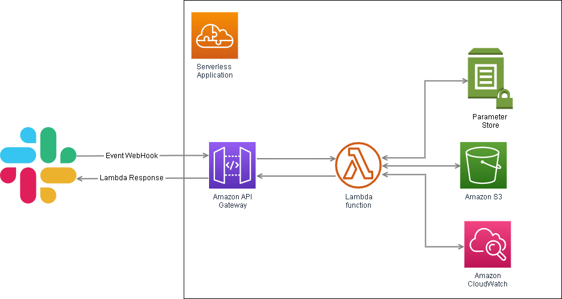)


## Building it
### Create your .env file

For the publicly available variables needed for our application, we will add a `.env` file at the root of our repo. You can copy the env.example content and fill the right side of the variables with the AWS region (default in North America would be `us-east-1` but make sure to confirm this in your AWS console) and the Coveo-related properties. The Coveo pipeline is optional and will use `default` if empty. Here's an example : 

```
COVEO_AWS_REGION=us-east-1
COVEO_ENDPOINT=https://platform.cloud.coveo.com
COVEO_ORG=myCompanyOrg
COVEO_PIPELINE=default
SLACK_SIGNING_SECRET=$YOUR_SIGNING_SECRET
```

### Create an Impersonation API key in the Coveo Platform 

Before creating our API key, let's set up our AWS parameter store to store it.


#### Create an AWS Parameter Store folder for your app

1. Navigate to the Parameter Store landing page, and click **Create parameter**.
 
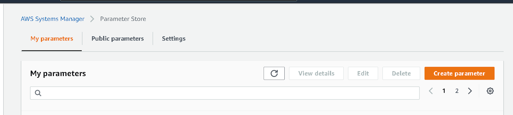)

2. Create a new name path for your application. For this example, we used the following path `/rd/coveo-autoreply-bot` with the parameter name `COVEO_API_KEY`. Make sure to give a unique path to your app-related tokens so we can give our Lambda restricted access to it later in the configuration. Also, make sure to select the `SecureString` type for the parameter. 

We don't have a value to store yet so we will generate an API Key.

#### Now that we are ready to create our secure parameter, let's create our Coveo API KEY:

1. In another tab, navigate to your Coveo platform and [create a Key](https://docs.coveo.com/en/1718/manage-an-organization/manage-api-keys#add-an-api-key). Make sure you add `Search - Impersonation`, `Analytics - Data, Push`, and `Analytics - Impersonate`. [_More on the impersonate Privilege and its danger_](https://docs.coveo.com/en/1707/manage-an-organization/privilege-reference#search-impersonate-domain)
2. When done, click ** Add key** and, copy the generated key.
3.  Browse back to your parameter store and add the API Key in the `COVEO_API_KEY` parameter value. Submit by clicking **Create parameter**.

_**Keep that key private!!!**_

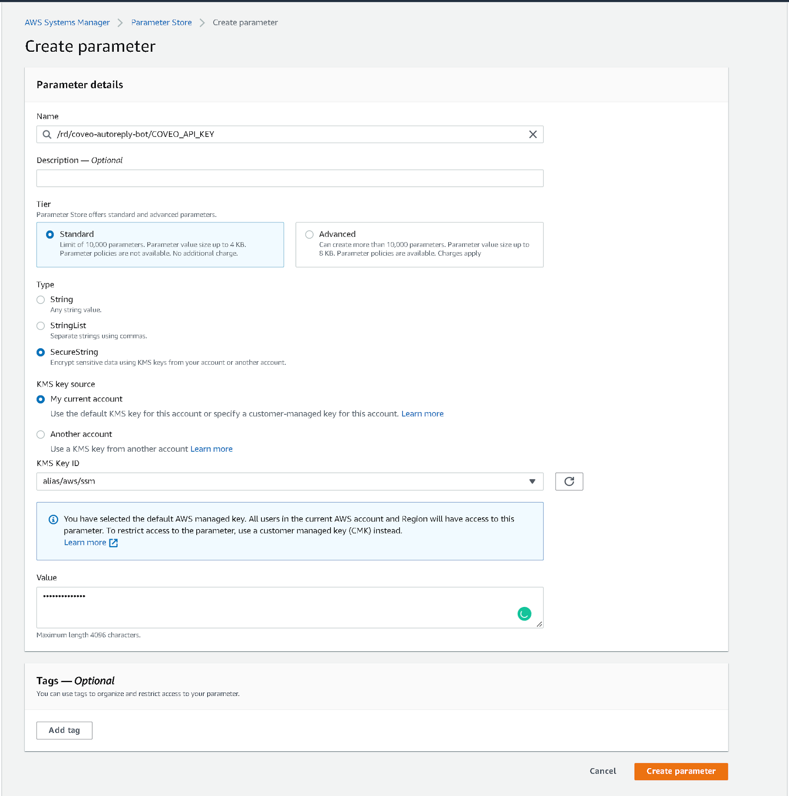)

### Create a Slack app
As an admin in the Slack workspace, navigate to https://api.slack.com/ and click `Create an App`. Two choices will be given to you: **From scratch** or **From an app manifest**. Select `From an app manifest`.

1. Select the workspace where the app should be created and click Next. 
2. Copy the `manifestExample.yml` file into the manifest configuration. If you want a custom name, make sure to change the `display_information -> name:` and the `bot_user -> display_name:`. Click on `Next`.
3. Review the OAuth scopes, features, and settings, and click Create.
4. Your app is now created. The Events request URL under Event Subscription will not work at this time but it's normal; we will need to set up AWS to generate a proper request URL in the next section.

#### Store the confidential tokens in your parameter store, with the `SecureString` type

1. Navigate to `Basic Information`.
2. Navigate to `App-Level Tokens`.
3. Click Generate Token and Scopes. 
4. Add both `connections:write` and `authorization:read` scopes to your token. Give it a name and generate it. Copy the token starting with `xapp` and store it in your Parameter Store with the same prefix path as before. For this example, we used `SLACK_APP_TOKEN` as the parameter name.
5. Navigate to `App Credentials`.
6. Show the `Signing Secret` and store it in your Parameter Store with the same prefix path as before. For this example, we used `SLACK_SIGNING_SECRET` as the parameter name.
7. Navigate to `OAuth & Permissions`.
8. Copy the `Bot User OAuth Token` under the `OAuth Tokens for Your Workspace` section and store it in your Parameter Store. For this example, we used `SLACK_BOT_TOKEN` as the attribute name

### Create a Lambda Application automatically with Serverless

The `serverless.yaml` file, in conjunction with the `handler.js` and `lambdaApp.js` are the ones that will be used by your AWS Lambda when deployed. For development ease, we will let serverless create an App using a CloudFormation template. The template will include:

* An S3 bucket to store and version your deployed app
* A Lambda function 
* A Gateway Rest API to access the Lambda 
* A Log Group to monitor your app

If you want to change the service name of your app (defaulted at autorepply-coveo-slack-bot), you can do it on the first line of the yaml file.
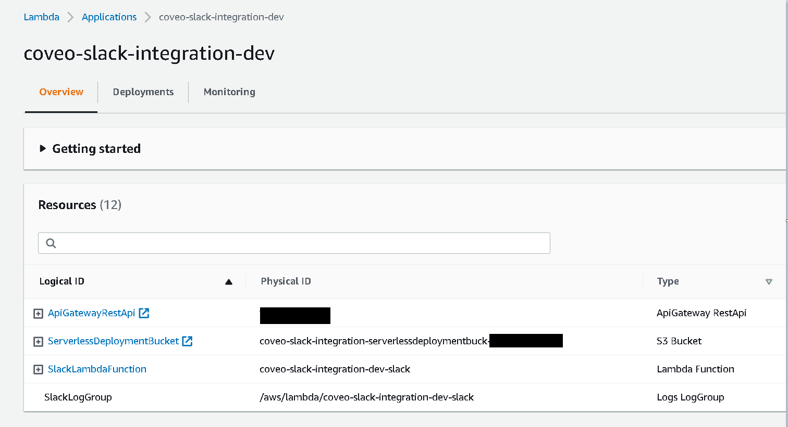)

To deploy your app (which will use the `lambdaApp.js` file) simply run `npm run dev`.

Warning: At first, your lambda will not have access to your parameter store so you will need to give it permission.

#### Add a policy to the lambda function to gain access to your parameters

1. Open the AWS Lambda console and click on your function's name.
2. Select the `Configuration` tab, and then click `Permissions`.
3. Click on the Execution role name.
   
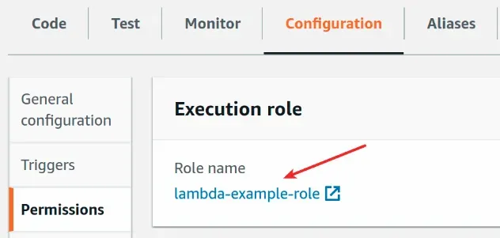)

4.  In the Permission policies section, click Add permissions, and then click Create inline policy.

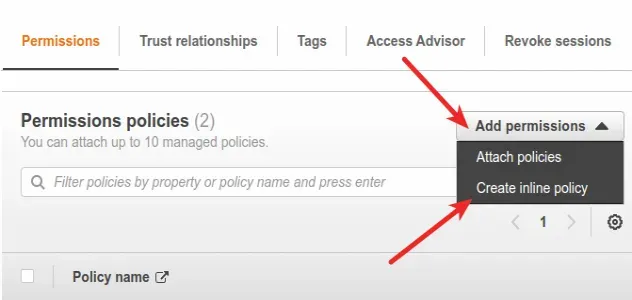)

5. With the Visual Editor, select System Manager as the Service, `GetParameter` as the Action, and the path to your application parameter folder followed by `/*` for the resources. The review policy should look like this: 
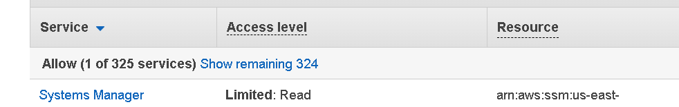)

6. Click `Create policy` when completed.

### Copy your Gateway API endpoint in the Slack app 

Now that your app is deployed to AWS, you will need to update the Slack App URLs.

1. Get your API Gateway endpoint URL. To do so, you can find it:
* In your terminal after having deployed your serverless app or in the AWS console. When found, copy it.
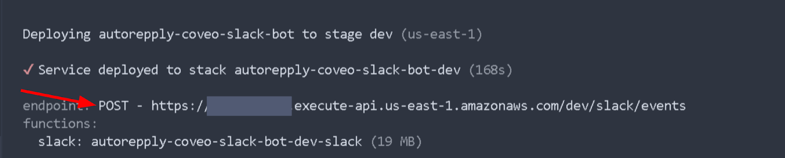)

* In the AWS console by browsing to the Lambda landing page and clicking on the `Functions` side menu, and clicking on your function name. You should see the API Gateway in the trigger section of your function overview. By clicking on it, you should see the trigger appear with an API endpoint listed. Copy it.

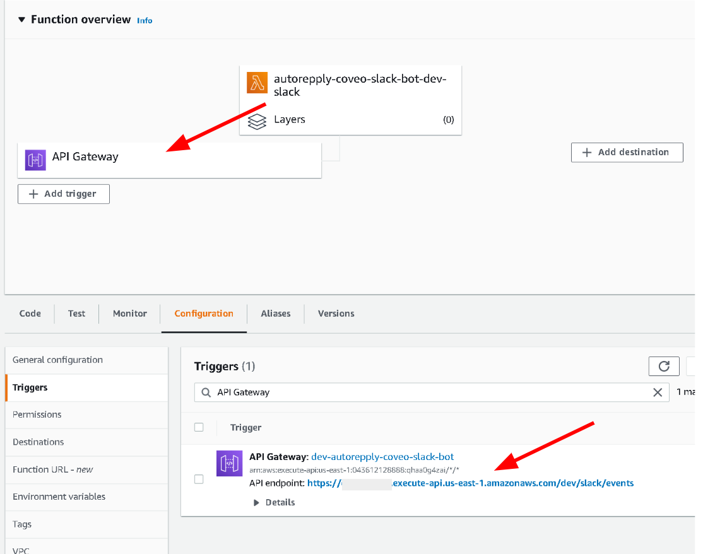)

2. Go back to your Slack app setup and navigate to the Events request URL under the `Event Subscription`. Paste the gateway URL. It should mark as `Verified`.

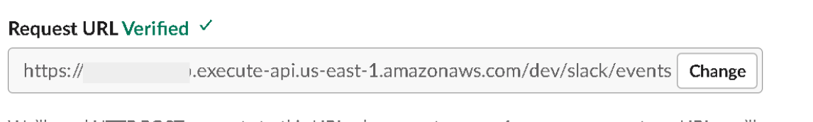)

### Install your Slack app to your workspace
1. Go to your Slack app setup and navigate to the `Basic Information`.
2. Click `Install to Workplace`. 
3. Confirm the information and the destination Workplace and click `Allow`.
   
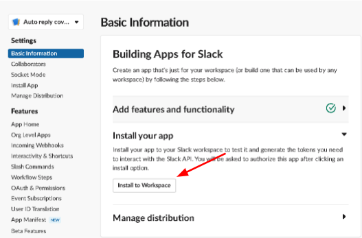)

### Local Debugging

1. To activate local debugging, you need to enable the Socket Mode in the application menu (found at https://api.slack.com/apps/$YOUR_APP_ID), in the `Socket Mode` menu under `Settings`. This will redirect your app events over a WebSockets connection. 
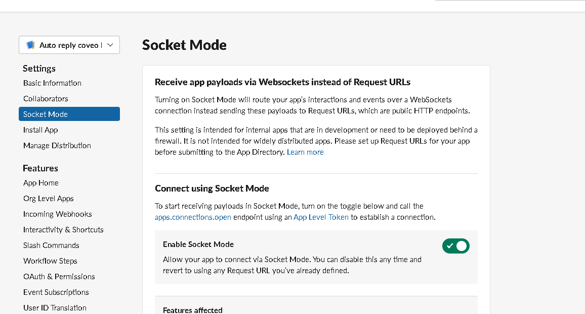)

2. In your terminal, run `npm run dev`, which will run the `app.js` code, which is set up to work with the SocketMode and hot-reload your code.
3. You can now change your bot behavior with a live result. 
4. When you are satisfied with your `app.js` code, update your `lambdaApp.js` code so it's working the same way. Make sure to follow the next section to deploy it properly.

### Updating the lambdaApp code from the app.js code
When you are satisfied with your `app.js` changes, you will need to move those changes to the `lambdaApp.js` so the lambda uses it. There is some difference between the `app.js` file and the `lambdaApp.js` that requires to stay untouched

1. The `lambdaApp.js` code header **needs** to import the AwsLambdaReceiver module to be triggered. 
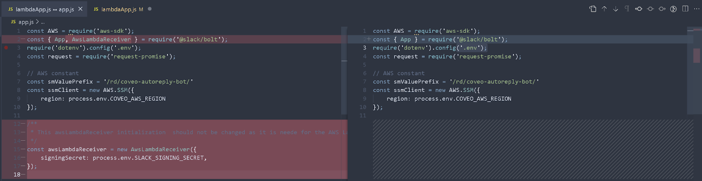)

2. The `lambdaApp.js` code footer **needs** to have the AwsLambdaReceiver in the app creation statement. Also, since it does not use the socket mode, it only needs the SLACK_BOT_TOKEN versus the `app.js` which needs the `SLACK_SIGNING_SECRET`, the `SLACK_APP_TOKEN`, and the socketMode set to true. Lastly, the `module.exports.handler`is required for the lambda to work, so make sure to keep it.
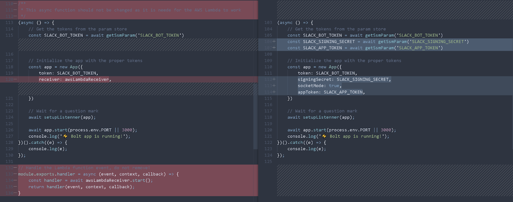)

### Use it 
In the channels you want questions answered, click the channel name and navigate to the Integrations tab. Under the Apps section, click Add, an App.
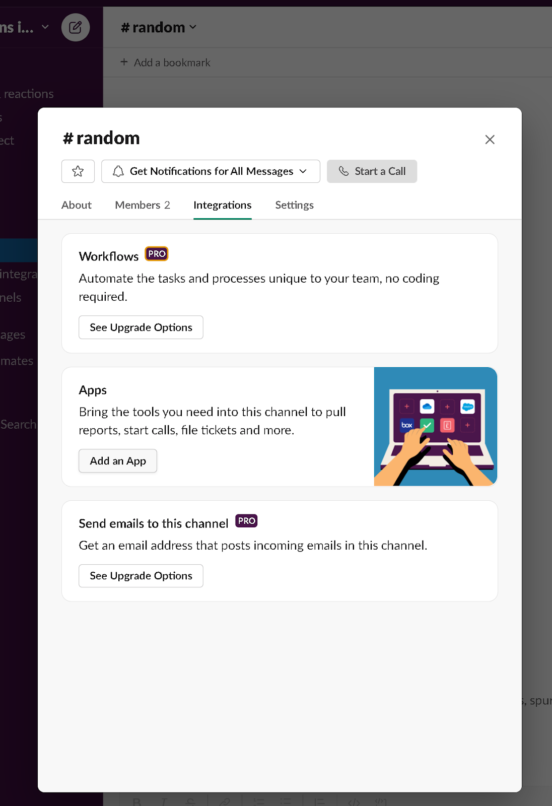)
And select your auto-reply bot app: 
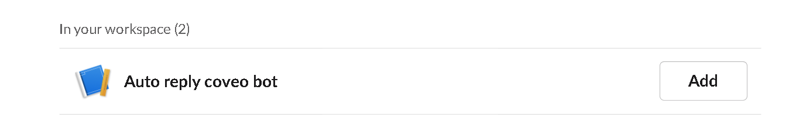)

Now, if any questions returned answered, your bot will answer them:
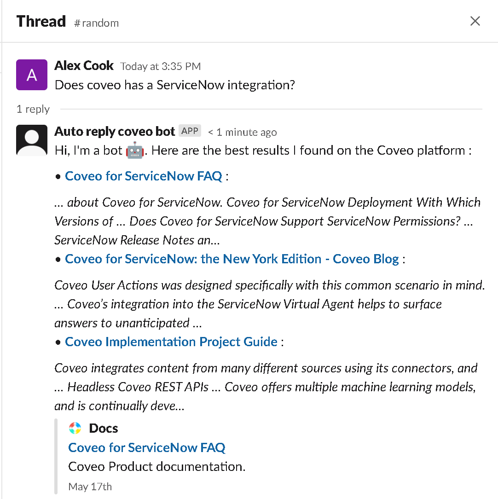)

In conclusion, this blog post showcased how to easily connect a Slack channel to an auto-reply bot querying Coveo. The GitHub repo can be found [here](https://github.com/coveo-labs/autoreply-coveo-slack-bot).

_Do you like connecting things together, getting access to all your content from wherever you want? [Join Coveo](https://careers.coveo.com/) and help make that dream a reality!_